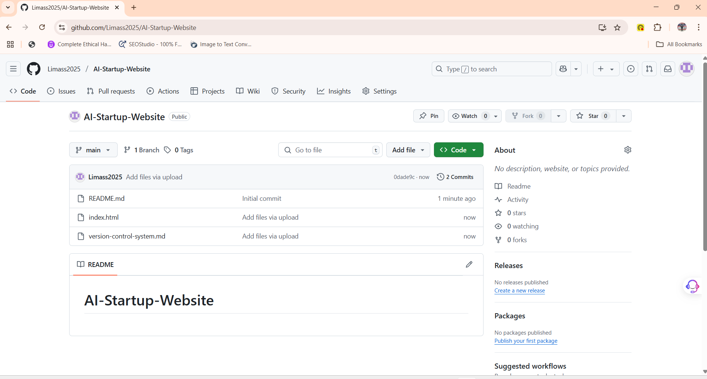
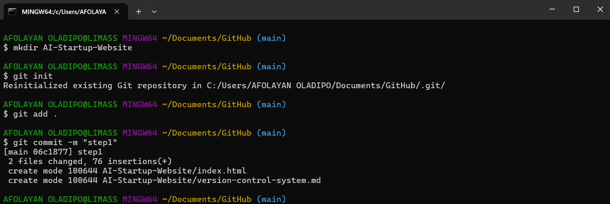
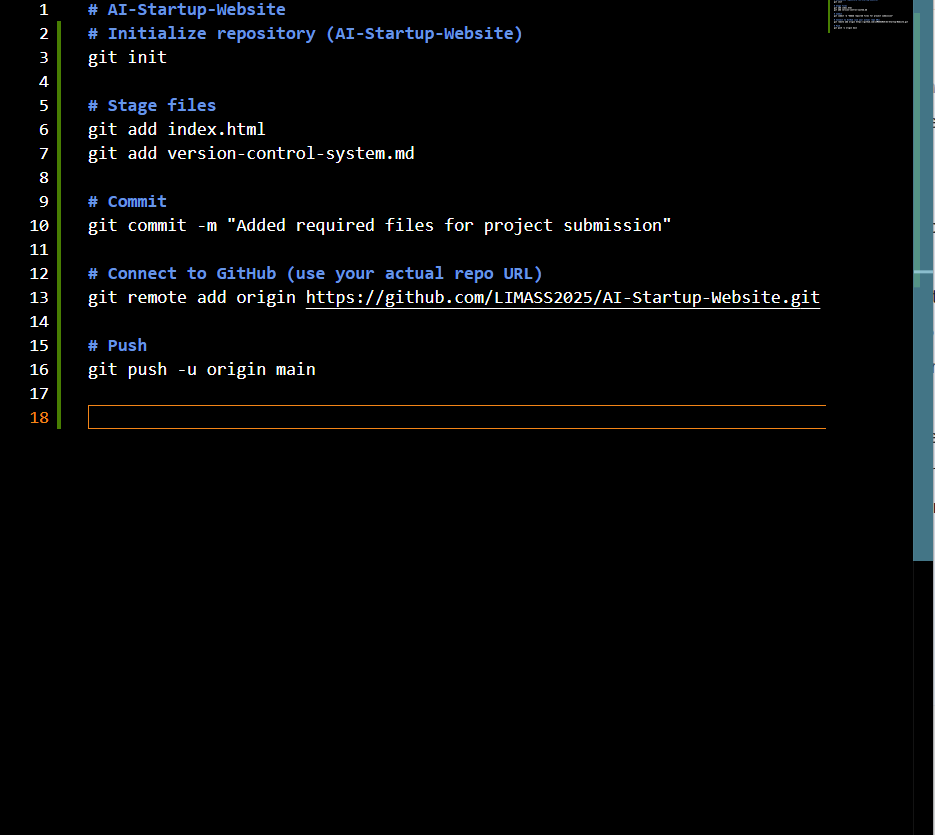

# AI-Startup-Website
# Initialize repository (AI-Startup-Website)
git init

# Stage files
git add index.html
git add version-control-system.md

# Commit
git commit -m "Added required files for project submission"

# Connect to GitHub (use your actual repo URL)
git remote add origin https://github.com/LIMASS2025/AI-Startup-Website.git

# Push
git push -u origin main

