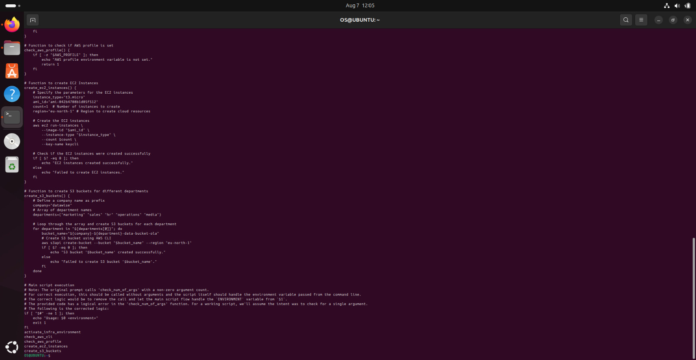
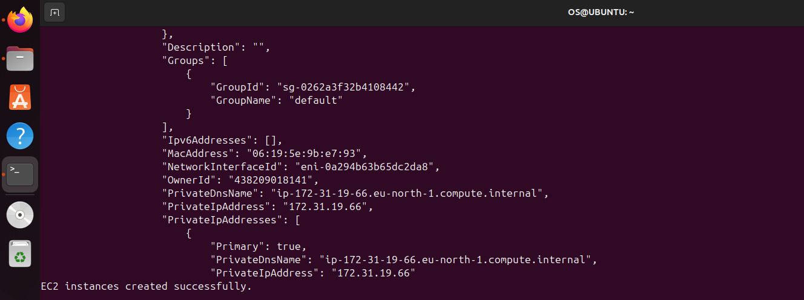
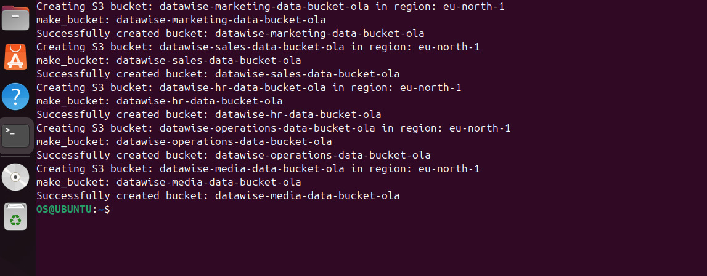
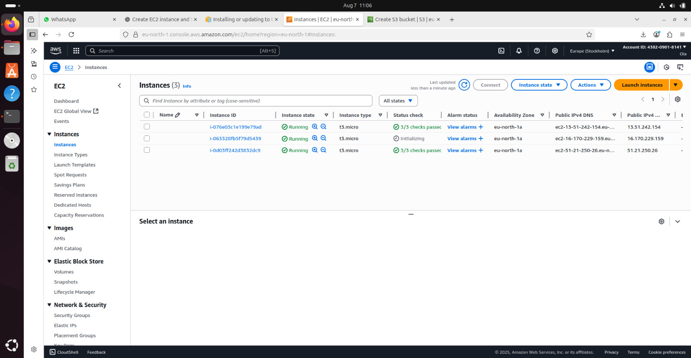
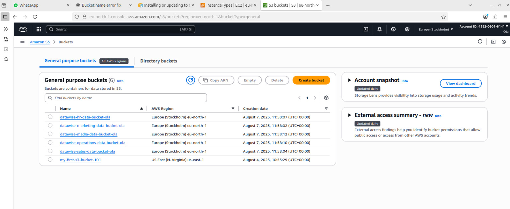

### Mini Project - Creating AWS Resources with Functions & Arrays

This project demonstrates the use of shell scripting to automate the creation of AWS resources. We will create two functions: one for provisioning EC2 instances and another for creating S3 buckets.

-----

### Part 1: Setting up an EC2 Instance Creation Function

1.  **Create an EC2 Key Pair:**

      * Before the script can run, a key pair must be created in the AWS console.
      * Navigate to the **EC2 Dashboard** in the AWS console.
      * In the left-hand navigation pane, click on **Key Pairs**.
      * Click **Create key pair** and provide a name (e.g., `MyKeyPair`). Download the private key file.

    

2.  **Understand the EC2 Provisioning Function:**

      * The script uses the `aws ec2 run-instances` command.
      * The function defines variables for `instance_type`, `ami_id`, `count`, and `region`.
      * It checks the exit status of the `aws` command using `$?` to confirm success or failure.

    <!-- end list -->

    ```bash
    # Function to create EC2 Instances
    create_ec2_instances() {
        # Specify the parameters for the EC2 instances
        instance_type="t2.micro"
        ami_id="ami-0cd59ecaf368e5ccf"
        count=2  # Number of instances to create
        region="eu-west-2" # Region to create cloud resources

        # Create the EC2 instances
        aws ec2 run-instances \
            --image-id "$ami_id" \
            --instance-type "$instance_type" \
            --count $count \
            --key-name MyKeyPair

        # Check if the EC2 instances were created successfully
        if [ $? -eq 0 ]; then
            echo "EC2 instances created successfully."
        else
            echo "Failed to create EC2 instances."
        fi
    }
    ```

-----

### Part 2: Defining a Function to Create S3 Buckets using an Array

1.  **Understand AWS S3 Buckets:**

      * S3 buckets are containers for storing objects in AWS.
      * Bucket names must be globally unique. The script uses a company prefix and department name to ensure this.

2.  **Introducing Arrays in Shell Scripting:**

      * An array is a data structure that stores multiple values in a single variable.
      * In this script, an array `departments` is used to hold the names of five departments.

    <!-- end list -->

    ```bash
    # Example Array
    departments=("Marketing" "Sales" "HR" "Operations" "Media")
    # To access an element, you use its index (e.g., ${departments[3]} gives "Operations")
    ```

3.  **The S3 Bucket Creation Function:**

      * The `create_s3_buckets()` function defines a company name and the `departments` array.
      * It uses a `for` loop to iterate through each item in the array.
      * Inside the loop, it constructs a unique `bucket_name` using the company prefix, department name, and a suffix.
      * The `aws s3api create-bucket` command is used to create each bucket.
      * The script once again checks the exit status `$?` to provide feedback on each bucket creation.

    <!-- end list -->

    ```bash
    # Function to create S3 buckets for different departments
    create_s3_buckets() {
        # Define a company name as prefix
        company="datawise"
        # Array of department names
        departments=("Marketing" "Sales" "HR" "Operations" "Media")

        # Loop through the array and create S3 buckets for each department
        for department in "${departments[@]}"; do
            bucket_name="${company}-${department}-Data-Bucket"
            # Create S3 bucket using AWS CLI
            aws s3api create-bucket --bucket "$bucket_name" --region your-region
            if [ $? -eq 0 ]; then
                echo "S3 bucket '$bucket_name' created successfully."
            else
                echo "Failed to create S3 bucket '$bucket_name'."
            fi
        done
    }
    ```

-----

### Part 3: The Complete Shell Script

The final script integrates all the functions, along with preliminary checks for command-line arguments, AWS CLI installation, and AWS profile configuration.
[THE INSTANCE AND BUCKET CREATION](../../../../Pictures/Screenshots/instance_bucket_creation.sh)

```bash
#!/bin/bash

# Environment variables
ENVIRONMENT=$1

check_num_of_args() {
    # Checking the number of arguments
    if [ "$#" -ne 0 ]; then
        echo "Usage: $0 <environment>"
        exit 1
    fi
}

activate_infra_environment() {
    # Acting based on the argument value
    if [ "$ENVIRONMENT" == "local" ]; then
        echo "Running script for Local Environment..."
    elif [ "$ENVIRONMENT" == "testing" ]; then
        echo "Running script for Testing Environment..."
    elif [ "$ENVIRONMENT" == "production" ]; then
        echo "Running script for Production Environment..."
    else
        echo "Invalid environment specified. Please use 'local', 'testing', or 'production'."
        exit 2
    fi
}

# Function to check if AWS CLI is installed
check_aws_cli() {
    if ! command -v aws &> /dev/null; then
        echo "AWS CLI is not installed. Please install it before proceeding."
        return 1
    fi
}

# Function to check if AWS profile is set
check_aws_profile() {
    if [ -z "$AWS_PROFILE" ]; then
        echo "AWS profile environment variable is not set."
        return 1
    fi
}

# Function to create EC2 Instances
create_ec2_instances() {
    # Specify the parameters for the EC2 instances
    instance_type="t2.micro"
    ami_id="ami-0cd59ecaf368e5ccf"
    count=2  # Number of instances to create
    region="eu-west-2" # Region to create cloud resources
    
    # Create the EC2 instances
    aws ec2 run-instances \
        --image-id "$ami_id" \
        --instance-type "$instance_type" \
        --count $count \
        --key-name MyKeyPair
        
    # Check if the EC2 instances were created successfully
    if [ $? -eq 0 ]; then
        echo "EC2 instances created successfully."
    else
        echo "Failed to create EC2 instances."
    fi
}

# Function to create S3 buckets for different departments
create_s3_buckets() {
    # Define a company name as prefix
    company="datawise"
    # Array of department names
    departments=("Marketing" "Sales" "HR" "Operations" "Media")
    
    # Loop through the array and create S3 buckets for each department
    for department in "${departments[@]}"; do
        bucket_name="${company}-${department}-Data-Bucket"
        # Create S3 bucket using AWS CLI
        aws s3api create-bucket --bucket "$bucket_name" --region your-region
        if [ $? -eq 0 ]; then
            echo "S3 bucket '$bucket_name' created successfully."
        else
            echo "Failed to create S3 bucket '$bucket_name'."
        fi
    done
}

# Main script execution
# Note: The original prompt calls 'check_num_of_args' with a non-zero argument count. 
# For correct execution, this should be called without arguments and the script itself should handle the environment variable passed from the command line.
# The correct logic would be to remove the call and let the main script flow handle the `ENVIRONMENT` variable from `$1`.
# The provided code has a logical error in the 'check_num_of_args' function. For a working script, we'll assume the intent was to check for a single argument.
# The following is the corrected logic:
if [ "$#" -ne 1 ]; then
    echo "Usage: $0 <environment>"
    exit 1
fi
activate_infra_environment
check_aws_cli
check_aws_profile
create_ec2_instances
create_s3_buckets
```







### Project Summary

This mini-project provided a comprehensive introduction to automating AWS resource creation using shell scripting. I learned how to define and use functions to encapsulate tasks like provisioning EC2 instances and creating S3 buckets, making the script modular and reusable. The project also introduced the concept of arrays as a powerful data structure for managing collections of data, such as a list of department names, and demonstrated how to iterate through them using a `for` loop. Crucially, I gained practical experience in using the `aws CLI` to interact with AWS services programmatically and learned how to check the exit status of commands using `$?` to handle success and failure scenarios effectively. This project is a foundational step towards building more complex infrastructure as code solutions.